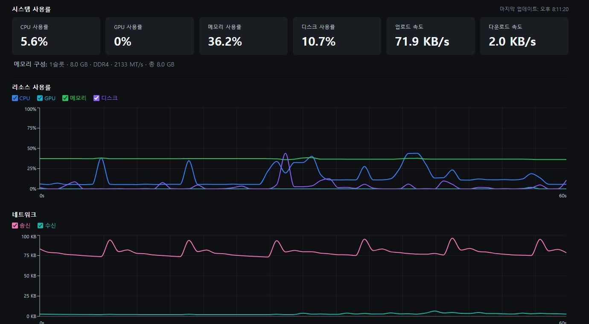
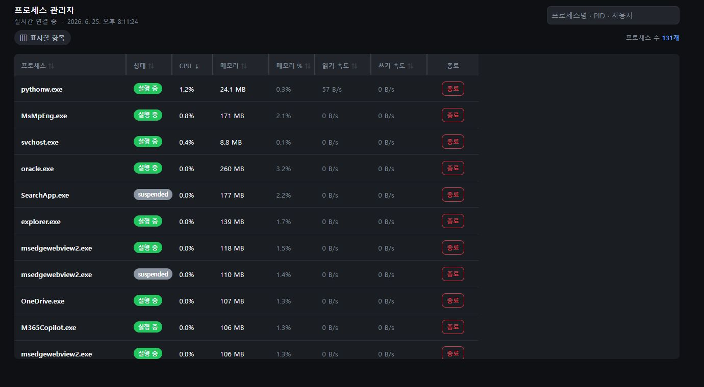
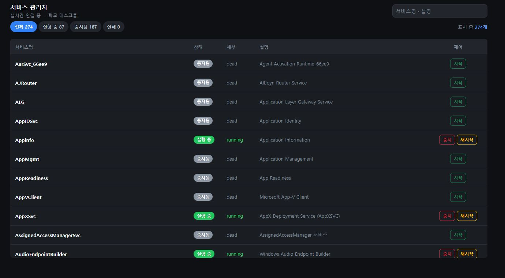
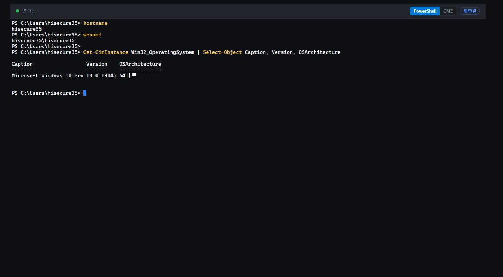
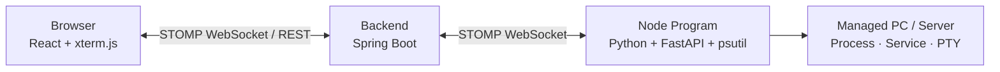

# Process Manager


Process Manager는 웹 브라우저에서 PC/서버의 상태를 실시간으로 확인하고 관리하는 원격 관리 시스템입니다.
관리 대상 장비에는 별도 노드 프로그램을 설치하고, 사용자는 웹 화면에서 모니터링, 프로세스 관리, 서비스 제어, 터미널 접속 기능을 사용할 수 있습니다.

## 화면

### 모니터링 대시보드

CPU, GPU, 메모리, 디스크, 네트워크 사용률을 실시간 차트로 확인합니다.



### 프로세스 관리

실행 중인 프로세스 목록을 조회하고 CPU/메모리 사용량 기준으로 확인할 수 있습니다.



### 서비스 관리

원격 장비의 서비스 상태를 확인하고 실행, 중지, 재시작 작업을 수행할 수 있습니다.



### 웹 터미널

브라우저에서 원격 장비의 터미널에 접속해 PC 이름, 접속 계정, OS 정보를 조회한 화면입니다.



## 주요 기능

| 기능 | 설명 |
|------|------|
| 실시간 모니터링 | CPU, GPU, 메모리, 디스크, 네트워크 사용률을 WebSocket 기반으로 수신하고 차트로 표시 |
| 프로세스 관리 | 원격 장비의 프로세스 목록, 상태, CPU/메모리 사용량, I/O 사용량 조회 및 종료 |
| 서비스 관리 | 원격 장비의 서비스 상태 조회, 실행, 중지, 재시작 |
| 웹 터미널 | 브라우저에서 PowerShell/CMD 또는 원격 쉘 접속 |
| 노드 관리 | 개인 노드와 팀 노드를 구분하여 여러 장비를 하나의 화면에서 관리 |
| 인증 | Google OAuth2 로그인, JWT Access Token, Refresh Token HttpOnly Cookie |
| 자동 재연결 | 브라우저 또는 노드 연결이 끊겼을 때 재연결 처리 |

## 프로젝트 구조

```text
processManager
├─ backend/        # Spring Boot API, 인증, WebSocket, DB 연동
├─ frontend/       # React + Vite 웹 클라이언트
├─ docs/images/    # README 화면 캡쳐 이미지
├─ Dockerfile      # Render 배포용 통합 빌드
└─ render.yaml     # Render Web Service 설정
```

노드 프로그램은 별도 저장소에서 관리합니다.

- [processManager-agent](https://github.com/duwon1/processManager-agent)

## 아키텍처



노드 프로그램이 백엔드에 아웃바운드로 연결하므로, 관리 대상 장비에 별도 포트포워딩을 설정하지 않고도 웹에서 상태 조회와 제어 요청을 처리할 수 있습니다.

## 기술 스택

| 구분 | 기술 |
|------|------|
| Backend | Java 21, Spring Boot 4.0.6, Spring Security, MyBatis |
| Database | MySQL, H2(Test), Redis |
| Frontend | React 19, Vite 8, Bootstrap 5, Recharts |
| Realtime | WebSocket, STOMP, SockJS |
| Terminal | xterm.js, PTY |
| Auth | Google OAuth2, JWT, Refresh Token Cookie |
| Agent | Python, FastAPI, psutil |
| Deploy | Docker, Render |

## API 문서

| 문서 | 내용 |
|------|------|
| **Swagger UI** (`/swagger-ui.html`) | REST API의 최신 소스. 코드 어노테이션에서 자동 생성되며 브라우저에서 직접 시험 호출 가능. 운영에서는 기본 비활성(`SPRINGDOC_ENABLED=true`로 활성화) |
| [docs/API.md](docs/API.md) | REST 개요 + **WebSocket/STOMP 명세**(Swagger가 다루지 않는 실시간 채널) |
| [docs/ARCHITECTURE.md](docs/ARCHITECTURE.md) | 시스템 구성과 핵심 흐름(로그인·에이전트 등록·삭제) Mermaid 다이어그램 |
| [docs/adr/](docs/adr/README.md) | 아키텍처 결정 기록(왜 이렇게 설계했는가) |

Swagger UI는 로컬 실행 후 <http://localhost:8080/swagger-ui.html> 에서 접속합니다.
우측 상단 **Authorize**에 Access Token(JWT)을 넣으면 보호된 엔드포인트를 시험할 수 있습니다.

## 실행 방법

### 백엔드

```bash
cd backend

# .env 파일 생성
cat > .env << EOF
DB_USERNAME=your_db_user
DB_PASSWORD=your_db_password
DB_URL=jdbc:mysql://localhost:3306/processmanager?useSSL=false&serverTimezone=Asia/Seoul&allowPublicKeyRetrieval=true&createDatabaseIfNotExist=true
JWT_SECRET=your_jwt_secret
GOOGLE_CLIENT_ID=your_google_client_id
GOOGLE_CLIENT_SECRET=your_google_client_secret
GOOGLE_MAIL_CLIENT_ID=your_gmail_api_oauth_client_id
GOOGLE_MAIL_CLIENT_SECRET=your_gmail_api_oauth_client_secret
GOOGLE_MAIL_REFRESH_TOKEN=your_gmail_api_refresh_token
GOOGLE_MAIL_FROM=your_project_gmail@gmail.com
APP_PUBLIC_URL=http://localhost:5173
APP_CORS_ALLOWED_ORIGINS=http://localhost:5173
EOF

./gradlew bootRun
```

관리 대상 장비에서 실행되는 노드 프로그램이 백엔드로 WebSocket 연결을 만들고, 웹에서는 그 연결을 통해 모니터링과 제어 요청을 처리합니다.

### 프론트엔드

```bash
cd frontend
npm install
npm run dev
```

개발 서버 기본 주소는 `http://localhost:5173`입니다.

## 배포

운영 배포는 Render Web Service를 사용합니다.
저장소 루트의 `Dockerfile`과 `render.yaml`로 프론트엔드와 백엔드를 함께 빌드해 하나의 Docker Web Service로 실행합니다.

기본 배포 주소:

```text
https://processmanager-web.onrender.com
```

## 노드 프로그램

노드 프로그램은 관리 대상 장비에서 실행되며, 시스템 상태 수집과 프로세스/서비스/터미널 제어 요청을 처리합니다.
프로필 화면에서 1회용 설치 토큰을 생성한 뒤 표시되는 설치 명령어를 실행하면 노드가 자동 등록됩니다.

설치 토큰은 5분 동안 유효하며, 등록에 한 번 사용되면 재사용할 수 없습니다.
