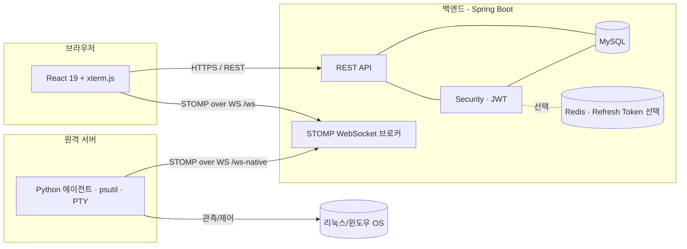
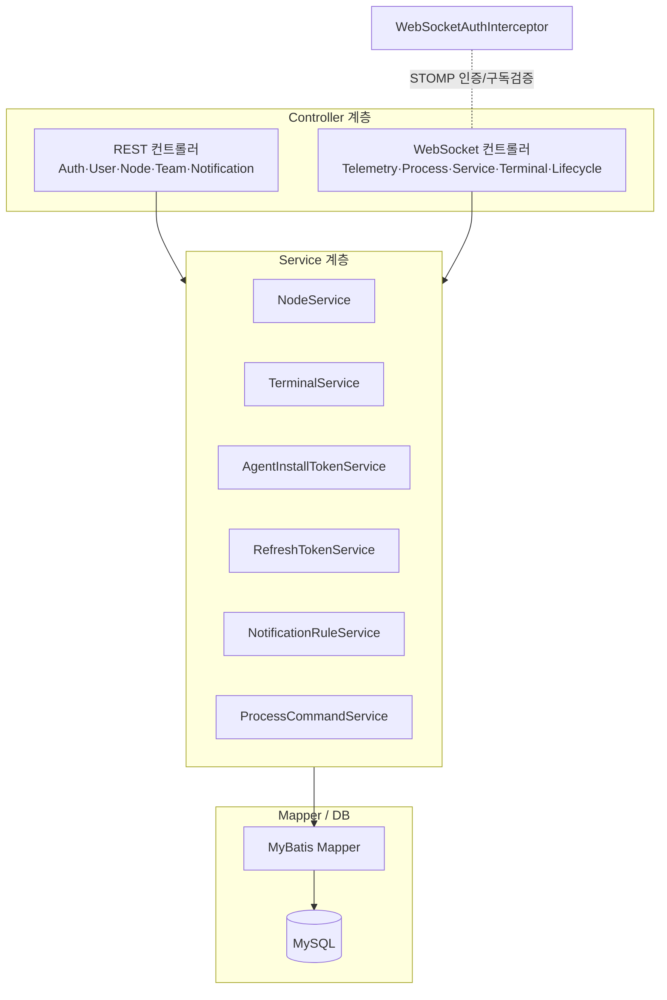
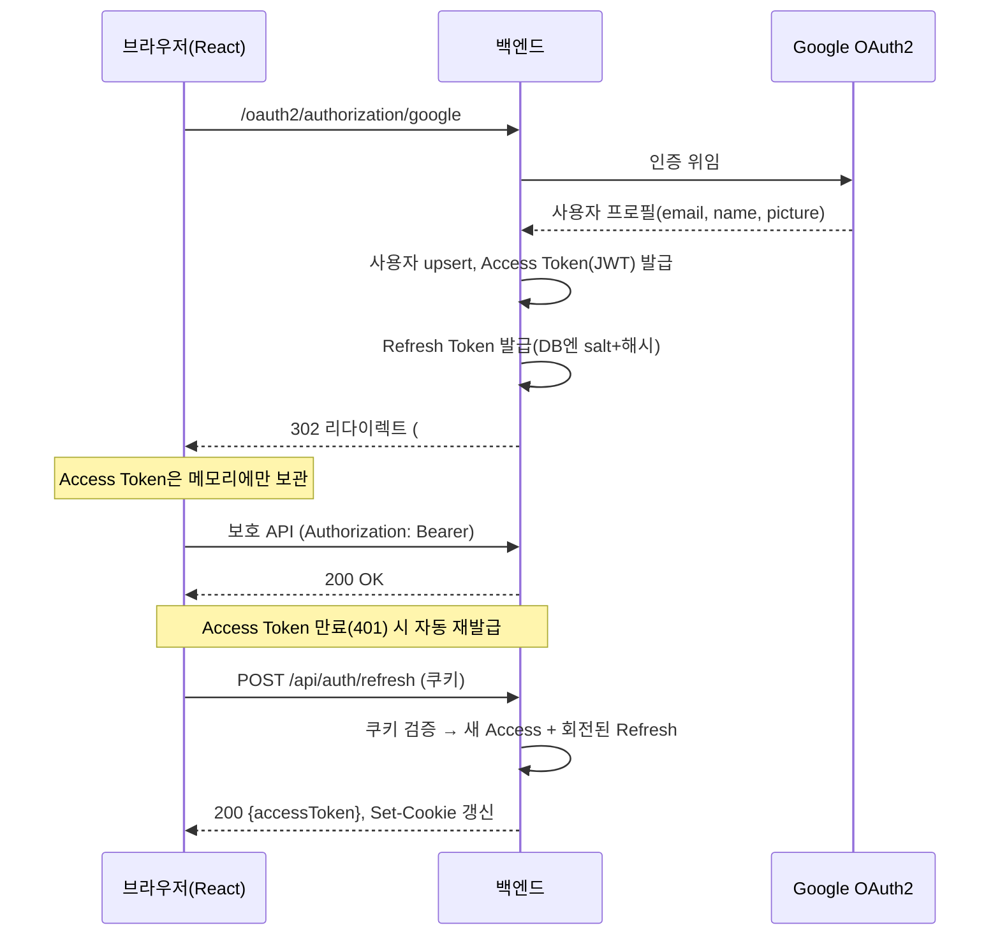
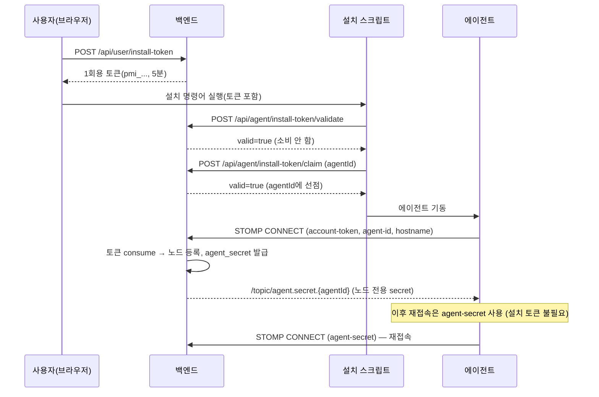
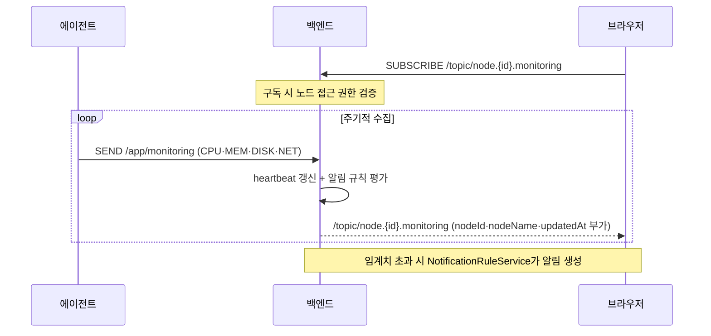
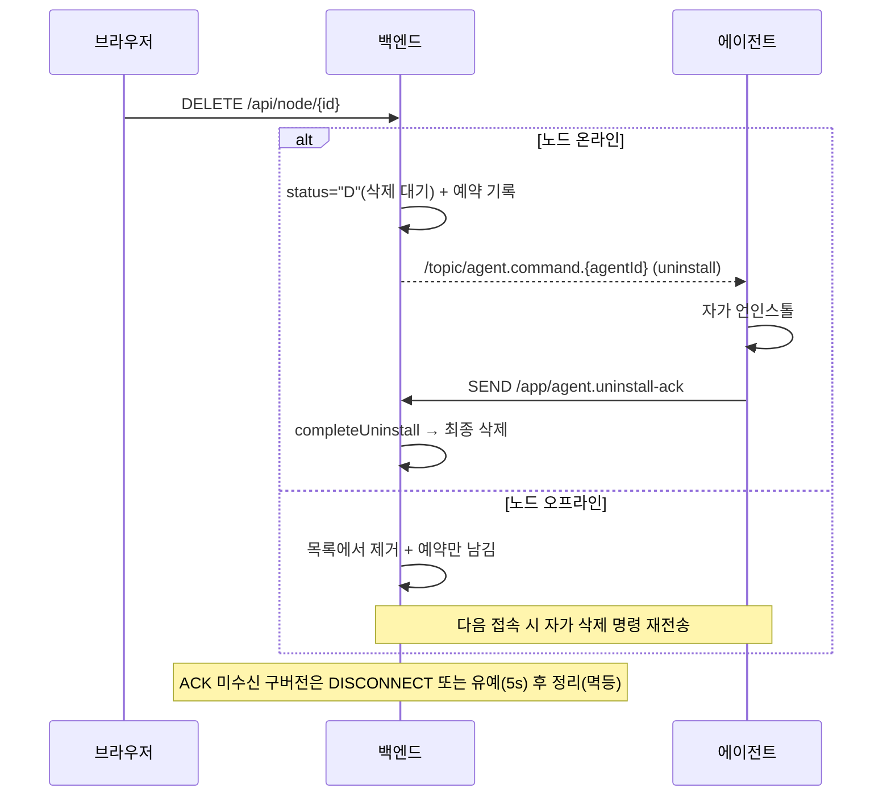

# 아키텍처 개요

Process Manager는 원격 서버를 웹에서 실시간 모니터링·관리하는 풀스택 애플리케이션입니다.
이 문서는 시스템 구성과 핵심 흐름을 다이어그램으로 설명합니다. 세부 결정 근거는 [ADR](adr/README.md),
API 상세는 [API.md](API.md)와 Swagger UI(`/swagger-ui.html`)를 참고하세요.

## 1. 시스템 구성

에이전트가 백엔드로 **아웃바운드** 연결하므로, 원격 서버에 공인 IP나 포트포워딩이 필요 없습니다.

## 2. 백엔드 레이어

## 3. 로그인 및 토큰 재발급 (ADR-0001)

## 4. 에이전트 등록 (ADR-0002)

## 5. 실시간 모니터링 흐름 (ADR-0003)

## 6. 노드 소프트 삭제 (ADR-0004)

## 7. 실시간 메시지 채널 요약

| 방향 | 접두사 | 예시 | 설명 |
|------|--------|------|------|
| 클라이언트 → 서버 | `/app` | `/app/monitoring`, `/app/terminal.input` | SEND 메시지 |
| 서버 → 브라우저 | `/topic/node.{id}.*` | `/topic/node.12.monitoring` | 노드별 브로드캐스트 |
| 서버 → 브라우저 | `/topic/user.{id}.*` | `/topic/user.3.agent.update-result` | 사용자별 알림 |
| 서버 → 에이전트 | `/topic/agent.*.{agentId}` | `/topic/agent.command.<uuid>` | 에이전트 전용 명령 |

> 전체 목적지·페이로드·권한 매핑은 [API.md](API.md)의 "WebSocket / STOMP API" 절을 참고하세요.
